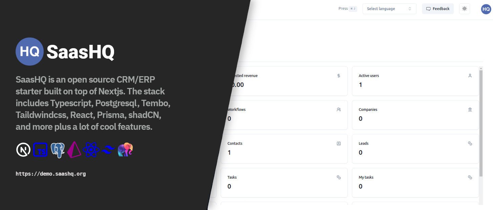

<a href="https://demo.saashq.org/">
  <h1 align="center">SaasHQ</h1>
</a>

<p align="center">

</p>

<p align="center">
SaasHQ is a CRM / ERP starter built on top of Next.JS 14 using TypeScript, the great UI library shadCN and Prisma, Postgresql+Tembo as the backend infrastructure. Upload things as an S3 blob for document storage. SaasHQ is based on the awesome NextCRM project by Pavel Dovhomilja. The Workflow engne is inspired by 
the Workflow-Engine project by Nisarg Bhatt.
</p>

<p align="center">
  <a href="https://twitter.com/saashqdev">
    
  </a>
  <a href="https://github.com/saashqdev/saashq/blob/main/LICENSE">
    
  </a>
</p>

<p align="center">
  <a href="#online-demo"><strong>Introduction</strong></a> ·
  <a href="#tech-stack--features"><strong>Tech Stack + Features</strong></a> ·
  <a href="#roadmap"><strong>Roadmap</strong></a> ·
  <a href="#installation"><strong>Installation</strong></a> ·
  <a href="#repo-activity"><strong>Repo activity</strong></a> ·
  <a href="#license"><strong>License</strong></a>
  <a href="https://discord.gg/kBhAUKBMgf"><strong>Discord</strong>  
</p>
<br/>


## Online Demo

You can try it here [demo.saashq.org](https://demo.saashq.org), login via Google/Github account or create new user and password.

## Tech Stack + Features

### Frameworks

- [Next.js](https://nextjs.org/) – React framework for building performant apps with the best developer experience
- [Auth.js](https://authjs.dev/) – Handle user authentication with ease with providers like Google, Twitter, GitHub, etc.
- [Prisma](https://www.prisma.io/) – Typescript-first ORM for Node.js
- [React Email](https://react.email/) – Versatile email framework for efficient and flexible email development

### Platforms

- [Vercel](https://vercel.com/) – Easily preview & deploy changes with git
- [Postgres](https://postgres.com/) – A database platform for seamless, scalable data management
- [Resend](https://resend.com/) – A powerful email framework for streamlined email development together with [react.email](https://react.email)
- [Tembo](https://tembo.io) - Goodbye database sprawl. Postgres hosting done the right way.

### Data fetching

- [SWR](https://swr.vercel.app/) – React Hooks library for remote data fetching
- [Axios](https://axios-http.com/) – Promise based HTTP client for the browser and node.js
- [Server Actions]() - for server side data fetching
- [Tanstack/react-query](https://react-query.tanstack.com/) - for server/client side data fetching

### UI

- [Tailwind CSS](https://tailwindcss.com/) – Utility-first CSS framework for rapid UI development
- [Shadcn/ui](https://ui.shadcn.com/) – Re-usable components built using Radix UI and Tailwind CSS
- [Tremor](https://www.tremor.so/) – A platform for creating charts
- [react.email](https://react.email) - together with [resend.com](https://resend.com)

### AI

- [OpenAI API](https://openai.com/blog/openai-api) - for automated email notifications generated by AI
- [Rossum](https://rossum.ai/) - for invoice data parsing with AI


## Roadmap

1. More AI powered - daily summary of tasks and project (OpenAI integration) - in progress
2. Email campaigns management - integration with MailChimp and Listmonk - in planning
3. ~~Docker version - in planning (There will be complete bundle to run SaasHQ on-premise)~~
4. Testing - Jest + Cypress (if anyone want to help I will be very happy) - in planning
5. Fix all Types issue (no more "any") - in progress
6. i18n - localization - in progress (if anyone want to help I will be very happy)
7. Turborepo - in planning
8. Upgrade to Next.js 14 - complete
9. Email client - in planning
10. More Marketing Automation Tools - in progress

## Emails

We use [resend.com](https://resend.com) + [react.email](https://react.email) as primary email sender and email templates.

## Reports

We use Tremor charts as a tool for creating charts in SaasHQ


## Documentation

Available soon at: https://docs.saashq.org

## Installation

<details><summary><b>Show instructions</b></summary>

1. Clone the repository:

   ```sh
   git clone https://github.com/saashqdev/saashq.git
   cd saashq
   ```

1. Install the preset:

   ```sh
   npm install
   ```

1. Copy the environment variables to .env

   ```sh
   cp .env.example .env
   ```

   ```sh
   cp .env.local.example .env.local
   ```

   **.env**

   > > - You will need a Postgresql URI string for Prisma ORM

   **.env.local**

   > > - NextAUTH - for auth
   > > - uploadthings - for storing files
   > > - rossum - for invoice data exporting
   > > - openAI - for automatic Project management assistant
   > > - SMTP and IMAP for emails

1. Init Prisma

   ```sh
    npx prisma generate
    npx prisma db push
   ```

1. Import initial data from initial-data folder

   ```sh
   npx prisma db seed
   ```

1. Run app on local

   ```sh
   npm run dev
   ```

1. http://localhost:3000

</details>

## Docker installation

[Link to Docker HUB](https://hub.docker.com/repository/saashqdev/saashq/general)

<details><summary><b>Show instructions</b></summary>

1. Postgreql URI string for Prisma ORM:

2. Install the preset:

   ```create
   .env (for Prisma URI string) and .env.local (all others ENVs) file inside docker folder
   ```

3. run docker-compose

   ```sh
   docker-compose up -d
   ```

4. Init Prisma

   ```sh
    docker-compose exec saashq npx prisma generate
    docker-compose exec saashq npx prisma db push
   ```

5. Import initial data from initial-data folder

   ```sh
   npx prisma db seed
   ```

6. http://localhost:3000
</details>

## Issues

- [Open an issue](https://github.com/saashqdev/saashq/issues) if you find a bug or have a suggestion for improvements.

## Contact

[saashq.org](https://saashq.org)

## Contributions

<a href="https://www.buymeacoffee.com/saashqdev" target="_blank"></a> 

## Repo Activity


## License

Licensed under the [MIT license](https://github.com/saashqdev/saashq/blob/main/LICENSE.md).
